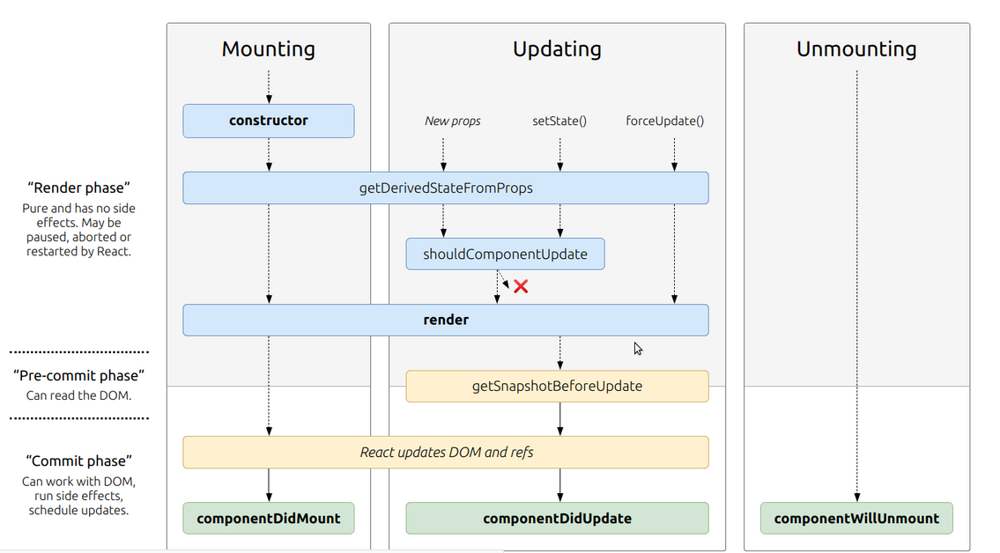

# State and Props

## What are component lifecycle events?
React lets us define components as classes or functions.

 The methods that we are able to use on these are called lifecycle events. 
 
 These methods can be called during the lifecycle of a component, and they allow us to update the UI and application states.

 

***Mounting***, ***Updating***, and ***Unmounting*** are the three phases of the component lifecycle.

**Mounting**

When an instance of a component is being created and inserted into the DOM it occurs during the mounting phase.

**Updating**

Anytime a component is updated or state changes then it is rerendered. 

**Unmounting**

The final phase of the lifecycle if called when a component is being removed from the DOM.

1. Based off the diagram, what happens first, the ‘render’ or the ‘componentDidMount’?  
render happen first

1. What is the very first thing to happen in the lifecycle of React?  
instance of a component is being created and inserted into the DOM

1. Put the following things in the order that they happen: componentDidMount, render, constructor, componentWillUnmount, React Updates.  
constructor ,  render ,componentDidMount , react update then componentWillUnmount

1. What does componentDidMount do?  
If we need to load anything using a network request or initialize the DOM, it should go here. This method is a good place to set up any subscriptions.

## React state VS props

1. What types of things can you pass in the props?  
the components inside the react

1. What is the big difference between props and state?  
props you pass into a component and state is handled inside of that component and props are handled outside of the component

1. When do we re-render our application?  
when we change the state inside of our application

1. What are some examples of things that we could store in state?  
the changes in our application like inside the form : an input element , check box .. etc
